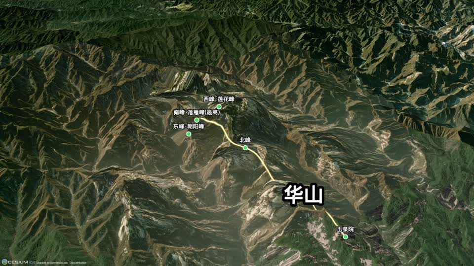
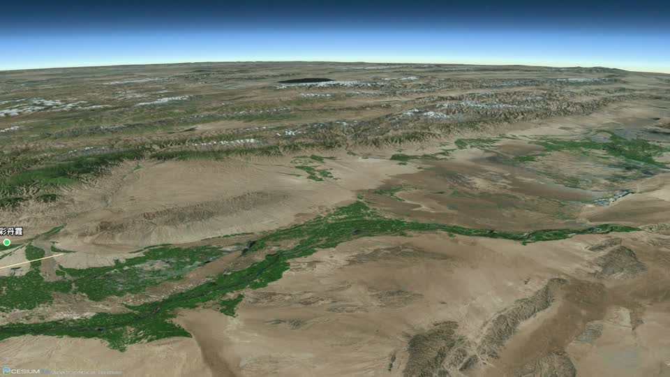
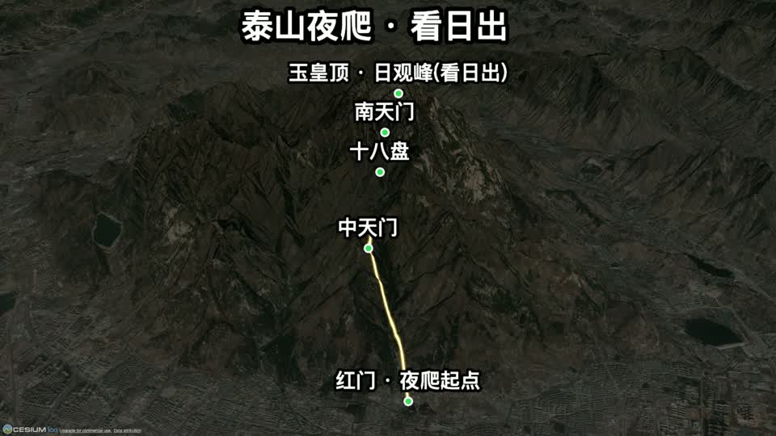
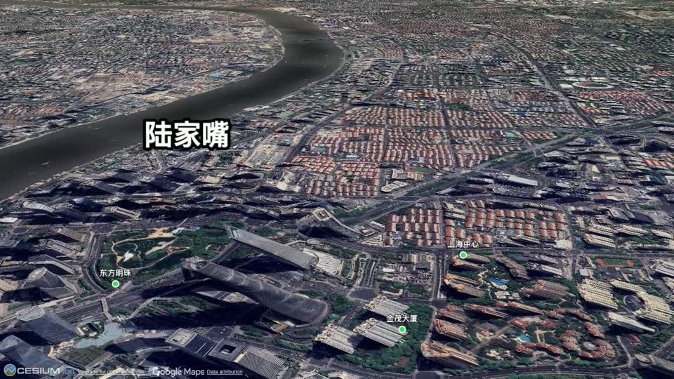

# GeoReel

**用一份 JSON 场景，生成电影感的三维地图飞行视频。**

[English](./README.md) · 简体中文

用 JSON 描述一个地点、一条路线和几个镜头动作，GeoReel 就让相机掠过真实卫星地形、沿地面逐段画出发光路线、弹入永不重叠的标签，渲染成 MP4——相机数学、瓦片加载、标签排布都替你算好。不需要 After Effects、Earth Studio，也不用手 K 关键帧。

它以 **Agent Skill** 形式发布：把文件夹交给编码智能体（Claude Code 等），说一句"给华山做个飞行视频，标出各峰和登山线路"，它就自动写场景、预览、渲染出成片。

<p align="center">
  
  
  <br/>
  
  
</p>

## 能做什么

| | |
| --- | --- |
| **镜头语言** | 只说意图——`flyin` 推近 / `orbit` 环绕 / `travel` 平移——编译器自动解算相机位置、朝向、距离。平移镜头沿超长路线（千公里走廊、山脉）匀速滑行，不必退到太空才看得全 |
| **真实三维地形** | 免费 Cesium ion token 加载 World Terrain + Imagery；城市题材可选 Google 实景三维建筑 |
| **自绘叠加层** | 路线、区域边框随相机推进逐段画出；POI 弹入且永不重叠（屏幕空间防碰撞 + 引线）；贴地形的锚定标题 |
| **夜间模式** | 压暗地图做夜爬 / 看日出题材——发光路线像一串头灯爬上暗夜山脊 |
| **转场与音频** | 白闪 / 黑场或真正的交叉溶解；可选 TTS 旁白与循环 BGM |
| **为迭代而生** | `--preview` 约 1 分钟出 3 帧校构图；`--workers N` 并行渲染、断点续传、崩溃自愈；1080p / 4K 预设 |

## 环境要求

- **Node.js** ≥ 18 · **Google Chrome**（无头渲染）· **ffmpeg**（在 `PATH`）
- **Cesium ion token**——在 <https://ion.cesium.com> 免费获取（*Access Tokens*）。不填则回退 Esri 平面影像（无立体地形）。

## 安装

把仓库地址交给你的编码智能体（Claude Code 等）：

> **照着 https://github.com/Vibetool/GeoReel 安装 GeoReel skill**

它会把仓库克隆进技能目录（Claude Code：`~/.claude/skills/geo-flyover/`），在 `render/` 里 `npm install`，并读取 [`SKILL.md`](./SKILL.md) 学习流程与字段。之后你只需描述想要的飞行视频，它就自动写场景、预览、渲染。请确保上面的[环境要求](#环境要求)就绪，并设置免费的 `CESIUM_ION_TOKEN`；开发路线见 [`ROADMAP.md`](./ROADMAP.md)。

## 快速上手

底层其实就两条命令——智能体会替你执行，你也可以自己跑：

```bash
cd render

# 预览：3 帧校对（约 1 分钟），先确认坐标与构图
node render.mjs ../scenes/huashan.json /tmp/out --preview

# 全渲 → /tmp/out/huashan.mp4（若场景含 audio 则另出 huashan-audio.mp4）
node render.mjs ../scenes/huashan.json /tmp/out --workers=2
```

**务必先 `--preview`**——比全渲快 6 倍地发现坐标写错或机位不佳。

## 内置示例场景

| 场景 | 演示 |
| --- | --- |
| `huashan.json` | 推近+环绕、立体峰、路线描画、标签防碰撞 |
| `taishan-night.json` | 夜间模式 + 旁白夜爬登顶 |
| `jinshanling-sunrise.json` | 拂晓沿长城 travel 滑行 + 旁白 |
| `hexi-travel.json` | 沿千公里河西走廊的 **travel 平移镜头** |
| `shanghai-3dtiles.json` | Google 实景三维城市建筑 |

完整字段说明与所有镜头类型见 [`SKILL.md`](./SKILL.md)，开发路线见 [`ROADMAP.md`](./ROADMAP.md)。

## 说明与署名

- Cesium ion 与 Google 实景三维要求**保留可见署名**——渲染器会在画面保留 Cesium 版权标识，发布时请勿裁掉。
- Cesium ion 免费额度与 Google 3D Tiles 面向非商业 / 评估用途；商业发布请核对各自条款。
- 卫星影像版权归各数据提供方。

## 许可

MIT —— 见 [LICENSE](./LICENSE)。
